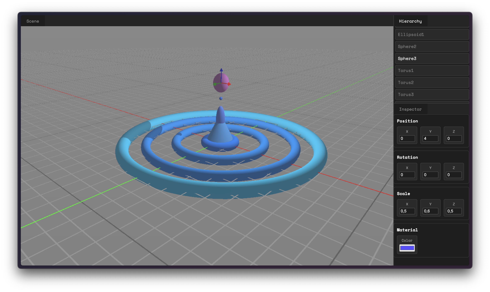

<!-- PROJECT SHIELDS -->


<!-- PROJECT LOGO -->
<br />
<div align="center">
  <a href="https://github.com/stantonik/rayflow">
    
  </a>

  <h3 align="center">rayflow</h3>

  <p align="center">
    A simple 3D graphic editor for ray marching rendering.
    <br />
    <br />
    <a href="https://stantonik.github.io/rayflow">View Demo</a>
  </p>
</div>

<!-- TABLE OF CONTENTS -->
<details>
  <summary>Table of Contents</summary>
  <ol>
    <li>
      <a href="#about-the-project">About The Project</a>
      <ul>
        <li><a href="#built-with">Built With</a></li>
      </ul>
    </li>
    <li>
      <a href="#getting-started">Getting Started</a>
      <ul>
        <li><a href="#prerequisites">Prerequisites</a></li>
        <li><a href="#installation">Installation</a></li>
      </ul>
    </li>
    <li><a href="#usage">Usage</a></li>
    <li><a href="#roadmap">Roadmap</a></li>
    <li><a href="#contributing">Contributing</a></li>
    <li><a href="#license">License</a></li>
  </ol>
</details>

<!-- ABOUT THE PROJECT -->
## About The Project

[](https://stantonik.github.io/rayflow)

This project is an experimental WebGPU-based 3D editor built with TypeScript and powered by ray marching. It focuses on simplicity, real-time interaction, and a clean UI that lets you build and explore procedural scenes without heavy engines or complex tooling.

You can add unlimited primitives, manipulate them directly in the viewport, and customize their properties through intuitive panels—all rendered using a single ray-marching pipeline.

The goal of the project is to serve as a lightweight playground for experimenting with signed distance fields (SDFs), procedural rendering techniques, and interactive scene editing in the browser. (_soon_)

### Features

* **Unlimited primitives** — Add or delete any number of shapes (Cuboid, Ellipsoid, Torus, Cone, and more) directly from the Hierarchy Panel.

* **Intuitive object selection** — Select objects by clicking them in the scene or choosing them from the Hierarchy Panel.

* **Real-time editing** — Modify any object’s properties instantly through the Inspector Panel, including Position, Rotation, Scale, Color, and more.

* **Gizmo support** — Use the built-in translation gizmo to move objects interactively within the scene. (More gizmo modes coming soon.)

### Built With

* WebGPU
* TypeScript

<!-- GETTING STARTED -->
## Getting Started

Setting up the project is quick and straightforward.

### Prerequisites

* Node.js (> v24)
* Recent browser supporting WebGPU

### Installation

_Below are the instructions to run the project on your computer._

2. Clone the repo
   ```sh
   git clone https://github.com/stantonik/rayflow.git
   ```
3. Install NPM packages
   ```sh
   npm install
   ```
5. Start the development server
   ```sh
   npm run dev
   ```

Enjoy exploring _Rayflow_ locally!


<!-- ROADMAP -->
## Roadmap

- [x] Feature basic interactivity
- [x] Create any primitives
- [x] Add translation gizmo
- [ ] Add all remaining gizmos (rotation, scaling, ...)
- [ ] Add custom object (with user-custom written SDF or primitive combination)
- [ ] Add interaction between objects
- [ ] Multi-language Support
    - [ ] Chinese
    - [ ] French

<!-- CONTRIBUTING -->
## Contributing

Contributions are what make the open source community such an amazing place to learn, inspire, and create. Any contributions you make are **greatly appreciated**.

If you have a suggestion that would make this better, please fork the repo and create a pull request. You can also simply open an issue with the tag "enhancement".
Don't forget to give the project a star! Thanks again!

<!-- LICENSE -->
## License

Distributed under the MIT License. See `LICENSE` for more information.

---
